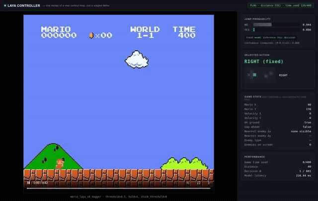

# Laya Plays Super Mario Bros

An experiment in fine-tuning [Laya](https://huggingface.co/convaiinnovations/laya) — a 421M-parameter
non-autoregressive "decision model" originally built for typed business classification (email
triage, ticket routing) — into a game-playing control policy for Super Mario Bros (NES), and
pushing it toward a speedrun.



*Live-synced replay: every number in the side panel is read from the same control loop actually playing the game — not staged. See [`models/laya/mario/demo/`](models/laya/mario/demo/) to run it yourself.*

**Full writeup, results table, and conclusions: [`models/laya/mario/FINAL_REPORT.md`](models/laya/mario/FINAL_REPORT.md).**
Every intermediate hypothesis (including the ones that failed) is logged in
[`models/laya/mario/runs/logs/`](models/laya/mario/runs/logs/).

## Headline result

A hand-coded, RAM-grounded reactive teacher (`teacher_v2`) and Laya, fine-tuned to imitate it plus
one DAgger correction round and a calibrated controller, both **complete World 1-1** —
`teacher_v2` in 110/400 in-game time units, Laya in 120/400. See the report for the full
comparison table, the bugs found and fixed along the way, and what was tried and didn't work
(running-speed optimization, more "reinforced" training data).

## Repo layout

```
models/laya/                    downloaded Laya checkpoint + its inference SDK (rl_agent_api.py, rl_common.py)
models/laya/mario/               this project
  ram_reader.py, state.py        validated NES RAM reads -> structured game state
  teacher.py                     hand-coded reactive policy (RuleTeacherV1/V2)
  controller.py                  emulator plumbing shared by every policy
  collect_data.py, dagger.py     imitation-learning data collection
  finetune.py                    fine-tunes Laya's decision head on the collected data
  eval.py                        plays real episodes; the calibrated Laya controller lives here
  record.py                      records a policy's playthrough to MP4
  demo/                          live-synced gameplay + decision-panel demo (see below)
  runs/                          checkpoints, logs, videos, eval results (large files git-ignored)
  data/                          collected imitation-learning datasets (JSONL)
```

## Setup

```bash
python3 -m venv .venv
source .venv/bin/activate
pip install torch --index-url https://download.pytorch.org/whl/cu128   # CPU-only: pip install torch
pip install -r requirements.txt
```

`ffmpeg` must be on `PATH` (used to encode the recorded gameplay videos).

### Download the base Laya checkpoint

Model weights are not committed to this repo (they exceed GitHub's per-file size limit — see
`.gitignore`). Fetch the checkpoint this project fine-tunes from:

```bash
huggingface-cli download convaiinnovations/laya \
  --include "typed-decisions/*" "README.md" "*.py" "rl_agent_config.json" \
  --local-dir models/laya
```

### Get a fine-tuned Mario checkpoint

The trained checkpoints (`models/laya/mario/runs/mario_laya_v*/`) are also git-ignored for the
same reason (each is ~1.6GB). Regenerate the final one:

```bash
python models/laya/mario/finetune.py \
  --data models/laya/mario/data/v6_aggregated.jsonl \
  --epochs 15 --seed 0 \
  --out models/laya/mario/runs/mario_laya_v6_dagger
```

This uses the dataset and seed already committed in this repo and reproduces the checkpoint
reported in `FINAL_REPORT.md` (~10 minutes on a single consumer GPU).

## Quick start

```bash
# Watch teacher_v2 (no model, pure reactive rules) clear World 1-1
python models/laya/mario/eval.py --policy rule_v2 --stages SuperMarioBros-1-1-v0

# Watch the fine-tuned Laya checkpoint clear it (config matters -- see FINAL_REPORT.md §8)
python models/laya/mario/eval.py --policy laya \
  --checkpoint models/laya/mario/runs/mario_laya_v6_dagger \
  --threshold 0.5 --hold-decisions 4 --stuck-threshold 8 \
  --stages SuperMarioBros-1-1-v0

# Live-synced gameplay + decision-panel demo (records once, then serves locally)
python models/laya/mario/demo/run_demo.py
```

## Reproducibility

Every dataset, checkpoint config, training seed, and evaluation result behind the numbers in
`FINAL_REPORT.md` is committed in this repo (`models/laya/mario/data/`,
`models/laya/mario/runs/*/training_log.json`, `models/laya/mario/runs/logs/eval_*.json`) except
the multi-GB model weight files themselves, which regenerate deterministically from them.
